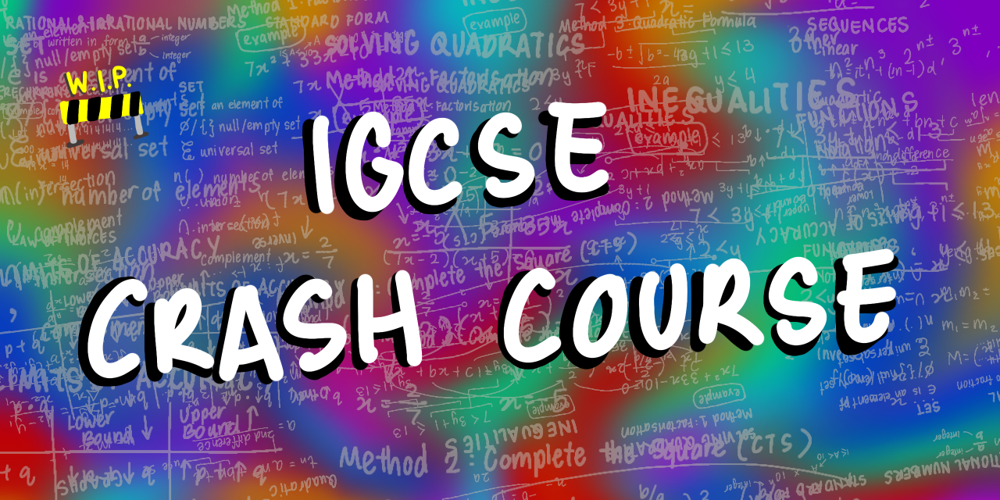

# IGCSE-Notes

> 🤓 An open learning resource for IGCSE

# ◼️ Table of Contents ◼️
- [Subjects](#Subjects)
- [Structure](#Structure)
    - [Subject Structure](##SubjectStructure)
    - [Lesson Structure](##LessonStructure)
    - [File Structure](##FileStructure)
- [Contributing](#Contributing)

# 📚 Subjects 📚
### - [Mathematics (0580)](/Mathematics(0580)/)
### - [Additional Mathematics (0606)](/Additional-Mathematics(0606)/)

# 🔶 Structure 🔶
## Subject Structure
In each subject README, there are links to:
- A table of Lessons
- 📄 Subject Summary Sheet
    - a condense summary of every topic in the subject
    - available on GitHub and Google Docs or as a PDF and .TeX document
- 📽️ Subject Summary Video
    - the subject summary sheet explained in a visual way
    - available of YouTube or LBRY or as an MP4 file
## Lesson Structure
Each Lesson contains
- 📔 Course Notes
    - which are explanations of concepts with examples of common/hard past paper questions and techniques on how to answer them
- 📽️ Course Video
    - course notes explained in a visual way
    - available of YouTube or LBRY or as an MP4 file
- 📝 Practice Questions
    - includes past paper questions and extra questions
- 🖋️ Answers to Practice Questions
    - detailed answers for the practice questions
## File Structure
- If you are cloning the repo, here is how the files for each subject are strcutured:
- 📁 [Subject Code] Subject
    - README
    - 📁 1-Topic_1
        - 📁 Images
            - 0-banner .png
            - 1-sketchnote .png
            - 2-image_description .png
            - ...
        - README .md (Course Notes)
        - Practice_Questions .md
        - Solutions_to_Practice_Questions .md
        - Course_Video .mp4
        - LaTeX_Course_Notes .tex
        - PDF_Course_Notes .pdf
    - 📁 2-Topic_2
    - ...

# Contributing
🚧 W.I.P.